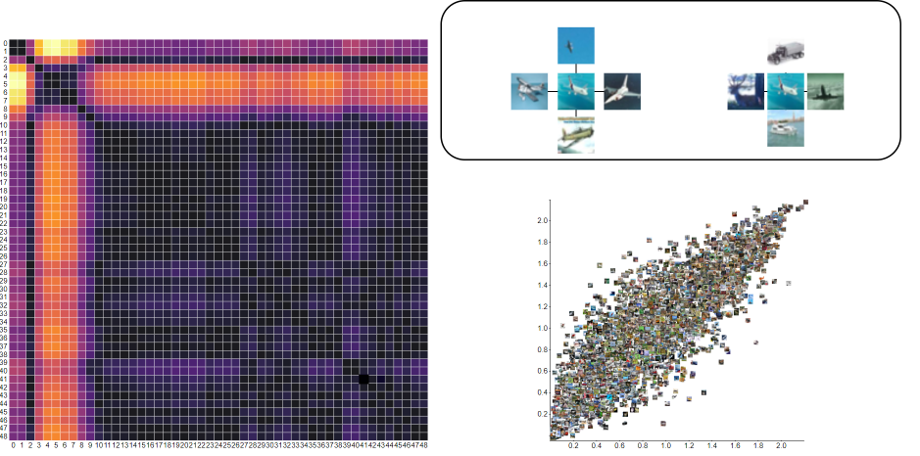

# ReprDynamics



This is a tool for visualizing the training dynamics of a neural network. It is inspired by the Neural Network Training Print https://link.springer.com/article/10.1007/s12650-021-00809-4

## Installing ReprDynamics

To install ReprDynamics you must clone this repo and install all dependencies.

```
git clone https://github.com/NoahBarrett98/ReprDynamics
cd ./path/to/ReprDynamics
conda create --name ReprDynamics python=3.9
pip install -e .
conda activate ReprDynamics
```


## Run sample visualization

A sample training session is provided in ./sample. 16 images from cifar-10 were used to train a simple neural network. Once ReprDynamics is installed, you can visualize this training session (flask will host the visualization on port 5000 by default):

```
cd /path/to/ReprDynamics
ReprDynamics --save_dir ./sample
```


## Using ReprDynamics to store training snapshots and computing transition heat maps

This repo is tested using pytorch, however is easily extendable to Tensorflow and other deep learning frameworks by overriding the store_batch() function found in back_end/ReprD.py. There are four steps to incorporating ReprDynamics into a pre existing workflow. An example for both the CPU and GPU can be found in ./back_end. 